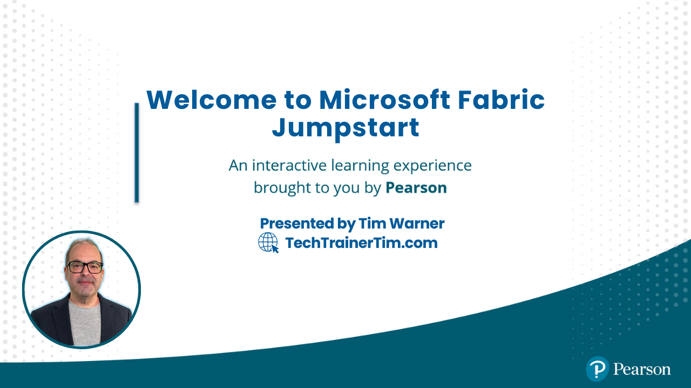

# Microsoft Fabric Jumpstart: Enterprise Analytics Training

**Published by Pearson and O'Reilly Media**

Welcome to the training hub for **Microsoft Fabric Jumpstart: Enterprise Analytics Training**. Whether you're preparing for the DP-600 certification or modernizing your enterprise analytics platform, this guide provides everything you need to master Microsoft Fabric's unified analytics ecosystem.

👉 **New to this repo?** Check out the [Getting Started Guide](GETTING-STARTED.md) for navigation help!  
📋 **Looking for the course plan?** View the [Course Plan](course-plan.md)!

*Last updated: March 18, 2024*

---

## 📬 **Contact Information**

---

## 📆 **Course Plan Overview**
This jumpstart course is structured into 5 segments, each focused on a key aspect of Microsoft Fabric:

<table>
<tr>
<td width="20%"><strong>Segment 1</strong></td>
<td width="20%"><strong>Segment 2</strong></td>
<td width="20%"><strong>Segment 3</strong></td>
<td width="20%"><strong>Segment 4</strong></td>
<td width="20%"><strong>Segment 5</strong></td>
</tr>
<tr>
<td>Introduction (30m)</td>
<td>Lakehouse (45m)</td>
<td>Real-Time (50m)</td>
<td>Data Science (45m)</td>
<td>Insights (40m)</td>
</tr>
</table>

💡 **See the full [detailed course plan](course-plan.md) for complete information!**

---

## 📋 **Course Objectives**
*Skills measured as of March 2024*

### Skills at a Glance

| Skill | Description |
|-------|-------------|
| 🏗️ Design Solutions | End-to-end data analytics solutions |
| 🏗️ Lakehouse | Medallion architecture implementation |
| ⚡ Real-Time | Event streams and processing |
| 🤖 Data Science | ML and predictive modeling |
| 📊 Power BI | Governed report creation |

### Audience Profile
This course is designed for data professionals who want to modernize their analytics platform using Microsoft Fabric. You'll learn how to implement, manage, and optimize analytics solutions in a unified environment.

#### Your responsibilities include:
- Building and managing data pipelines
- Implementing data quality controls
- Creating real-time analytics solutions
- Developing machine learning models
- Delivering business insights

#### Required experience:
- Basic Azure familiarity
- Understanding of data fundamentals
- Optional: Programming experience (Python, SQL)

### Detailed Skill Outline

<strong>1. Introduction to Microsoft Fabric</strong>

- Understanding Fabric's architecture
- Setting up workspaces and OneLake
- Navigating Fabric's unified interface
- Managing Fabric capacities

<strong>2. Building a Lakehouse</strong>

- Implementing medallion architecture
- Creating data pipelines
- Transforming data with Spark
- Managing data quality

<strong>3. Real-Time Analytics</strong>

- Configuring event streams
- Working with KQL databases
- Implementing real-time monitoring
- Processing streaming data

<strong>4. Advanced Analytics and AI</strong>

- Performing data science
- Tracking ML experiments
- Building predictive models
- Managing ML workflows

<strong>5. Delivering Insights</strong>

- Creating Power BI reports
- Managing deployment pipelines
- Implementing security controls
- Governing data access

---

## 🚀 **The Good Stuff: Must-Have Fabric Resources**

| Resource | Description | Link |
|----------|-------------|------|
| 📚 Documentation | Official Fabric docs | [View](https://learn.microsoft.com/fabric/) |
| 🆓 Trial | Get started with Fabric | [Sign Up](https://www.microsoft.com/microsoft-fabric) |
| 👥 Community | Connect with others | [Join](https://community.fabric.microsoft.com/) |
| 📰 Blog | Latest updates | [Read](https://blog.fabric.microsoft.com/) |
| 📝 Updates | Release notes | [Check](https://learn.microsoft.com/fabric/release-notes/) |

---

## 📚 **Microsoft Learn Paths**
Structured learning paths to master Fabric:

| Path | Description | Link |
|------|-------------|------|
| 🚀 Get Started | Fabric fundamentals | [Learn](https://learn.microsoft.com/training/paths/get-started-fabric/) |
| 🏗️ Lakehouse | Build data lakes | [Learn](https://learn.microsoft.com/training/paths/build-lakehouse-fabric/) |
| ⚡ Real-Time | Stream processing | [Learn](https://learn.microsoft.com/training/paths/implement-real-time-analytics-fabric/) |
| 🤖 Data Science | ML workflows | [Learn](https://learn.microsoft.com/training/paths/perform-data-science-fabric/) |
| 📊 Power BI | Report creation | [Learn](https://learn.microsoft.com/training/paths/create-powerbi-reports-fabric/) |

---

## 🛡️ **Best Practices**
Expert guidance for implementing Fabric:

### Data Architecture
- [Medallion architecture](https://learn.microsoft.com/fabric/onelake/onelake-medallion-lakehouse-architecture)
- [Lakehouse design](https://learn.microsoft.com/fabric/data-engineering/lakehouse-overview)
- [Data modeling](https://learn.microsoft.com/fabric/data-warehouse/data-modeling)

### Performance Optimization
- [Direct Lake mode](https://learn.microsoft.com/fabric/data-engineering/direct-lake-mode)
- [Query optimization](https://learn.microsoft.com/fabric/data-warehouse/query-optimization)
- [Resource management](https://learn.microsoft.com/fabric/enterprise/capacity-management)

### Security & Governance
- [Security overview](https://learn.microsoft.com/fabric/security/security-overview)
- [Data governance](https://learn.microsoft.com/fabric/governance/overview)
- [Access control](https://learn.microsoft.com/fabric/security/access-control)

---

## 🔧 **Your Toolkit**
Essential tools to follow along:

| Category | Tools |
|----------|-------|
| 🛠️ Development | [VS Code](https://code.visualstudio.com/), [Storage Explorer](https://azure.microsoft.com/features/storage-explorer/), [Power BI Desktop](https://www.microsoft.com/download/details.aspx?id=58494) |
| ☁️ Azure | [Free Subscription](https://azure.microsoft.com/free/), [Fabric Trial](https://www.microsoft.com/microsoft-fabric), [Azure DevOps](https://azure.microsoft.com/services/devops/) |
| 📚 Learning | [Documentation](https://learn.microsoft.com/fabric/), [Samples](https://github.com/microsoft/fabric-samples), [Community](https://community.fabric.microsoft.com/) |

---

## 💻 **Hands-on Labs & Practice**
Learn through hands-on experience:

---

## ✍️ **Practice & Certification**
Validate your knowledge:

---

## 🎓 **Related Certifications**
Expand your Microsoft data credentials:

| Certification | Level | Link |
|---------------|--------|------|
| DP-900 | Fundamentals | [Learn](https://learn.microsoft.com/certifications/azure-data-fundamentals) |
| DP-203 | Associate | [Learn](https://learn.microsoft.com/certifications/azure-data-engineer) |
| PL-300 | Associate | [Learn](https://learn.microsoft.com/certifications/power-bi-data-analyst-associate) |

---

## 💸 **Exam Discounts and Registration Info**

---

## 🎥 **Tim's Helper Videos**

---

## 📱 **Community & Support**
Connect with data professionals:

---

This README is designed for maximum utility and easy navigation. If you have suggestions or corrections, feel free to reach out via the contact information above. Best of luck on your Microsoft Fabric journey!

