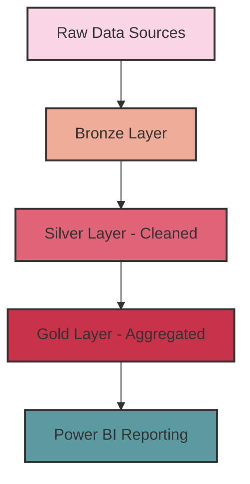

# Microsoft Fabric Jumpstart: Final Course Plan

## Course Timing Schedule (4 Hours)

- **11:00 AM** - Segment 1: Introduction to Microsoft Fabric (Introduction, Workspaces, RBAC)
- **12:00 PM** - 10-minute break
- **12:10 PM** - Segment 2: Batch Processing in Fabric
- **01:10 PM** - 10-minute break
- **01:20 PM** - Segment 3: Batch and Streaming Analytics
- **02:20 PM** - 10-minute break
- **02:30 PM** - Segment 4: Fabric Certification
- **03:00 PM** - End of session

---

## Segment 1: Introduction to Microsoft Fabric (60 minutes)

### Pre-Session Checklist
- Microsoft Fabric trial activated
- Demo workspace already created
- Sample files ready for upload
- Browser tabs open to Microsoft Learn resources

### Key Learning Objectives
- Understand Fabric's position in the Microsoft data ecosystem
- Identify main components: OneLake, Lakehouse, Real-Time Analytics, etc.
- Set up a Fabric workspace and understand role-based access control (RBAC)

### Step-by-Step Demo Plan

#### 1. Microsoft Fabric Overview (15 minutes)
- Show the Fabric homepage at [fabric.microsoft.com](https://fabric.microsoft.com)
- **Click Path:** Sign in → Show the Fabric homepage → Navigate to Workspaces
- **Highlight:** Explain how Fabric unifies what were previously separate products
- **Visual Aid:** Show slide with Fabric architecture diagram

#### 2. Workspace Creation & Tour (15 minutes)
- **Click Path:** Home → Create a Workspace → Name it "Contoso Analytics" → Create
- **Explain:** Fabric-enabled workspaces vs. regular Power BI workspaces
- **Click Path:** Inside workspace → Show different experience switcher (Data Engineering, Data Factory, etc.)
- **Highlight:** Point out how all experiences share the same data in OneLake

#### 3. RBAC Configuration (15 minutes)
- **Click Path:** Workspace settings → Access
- **Explain:** Different roles (Admin, Member, Contributor, Viewer)
- **Demo:** Add a new user with specific permissions
- **Highlight:** Best practices for workspace security in enterprise environments

#### 4. First Data Upload (10 minutes)
- **Click Path:** Create → Lakehouse → Name it "ContosoLakehouse"
- **File Upload:** 
  - Navigate to Files view
  - Upload `fabric-samples/emp.csv` file
  - Show the automatic schema detection
- **Highlight:** Point out that this data is now available across all Fabric experiences

#### 5. Q&A and Preview of Next Segment (5 minutes)
- Address any immediate questions
- Preview what we'll do with this data in the next segment

### Can't-Miss Examples
- Show the **Sales dataset** example that's built into Fabric
- Demonstrate the **SQL endpoint** by clicking on "SQL analytics endpoint" in the lakehouse
- Show **workspace sharing** by adding a member with different permissions

---

## Segment 2: Batch Processing in Fabric (60 minutes)

### Pre-Session Checklist
- Lakehouse already created in previous segment
- Pipeline samples ready to import
- Demo data sources prepared

### Key Learning Objectives
- Implement medallion architecture (Bronze/Silver/Gold)
- Create data pipelines for batch ingestion
- Transform data using notebooks

### Step-by-Step Demo Plan

#### 1. Medallion Architecture Overview (10 minutes)
- **Explain:** Bronze (raw), Silver (clean), Gold (business-ready) concept
- **Click Path:** Lakehouse → Files → Create folders called "Bronze", "Silver", "Gold"
- **Highlight:** Show slide with medallion data flow

#### 2. Data Pipeline Creation (20 minutes)
- **Click Path:** New → Pipeline → Name it "Contoso Sales Ingest"
- **Step-by-Step:**
  1. Add Copy Data activity
  2. Source: HTTP connector
     - Base URL: `https://raw.githubusercontent.com/microsoft/fabric-samples/main/docs-samples/data/sales.csv`
     - Click "Preview data" to show sample
  3. Sink: Lakehouse
     - Connect to ContosoLakehouse
     - Select "Bronze" folder
     - File name: `sales.csv`
  4. Click "Validate" then "Run"
  5. Show successful pipeline execution

#### 3. Data Transformation with Notebook (25 minutes)
- **Click Path:** New → Notebook → Name it "CleanSalesData"
- **Code Blocks to Type:**

  ```python
  # Read the bronze data
  df = spark.read.format("csv").option("header", "true").load("Files/Bronze/sales.csv")
  display(df)
  
  # Basic data cleaning
  from pyspark.sql.functions import col, when, trim
  
  df_clean = df \
      .withColumn("Revenue", col("Revenue").cast("double")) \
      .withColumn("Product", trim(col("Product"))) \
      .withColumn("Region", when(col("Region") == "N/A", None).otherwise(col("Region")))
  
  display(df_clean)
  
  # Save to silver layer as Delta table
  df_clean.write.format("delta").mode("overwrite").save("Files/Silver/sales_silver")
  
  # Create table from the saved files
  spark.sql("CREATE TABLE IF NOT EXISTS sales_silver USING DELTA LOCATION 'Files/Silver/sales_silver'")
  ```

- **Highlight:** Run each cell and explain the transformations

#### 4. Query the Transformed Data (5 minutes)
- **Click Path:** Lakehouse → SQL endpoint
- Run a sample query:
  ```sql
  SELECT 
    Product,
    SUM(Revenue) as TotalRevenue
  FROM
    sales_silver
  GROUP BY
    Product
  ORDER BY
    TotalRevenue DESC
  ```

### Can't-Miss Examples
- Use the **Data Factory Copy assistant** to simplify pipeline creation
- Show **Delta Lake Time Travel** with this query:
  ```sql
  SELECT * FROM sales_silver VERSION AS OF 0
  ```
- Demonstrate **notebook visualization** tools by adding a simple bar chart visualization

---

## Segment 3: Batch and Streaming Analytics (60 minutes)

### Pre-Session Checklist
- Batch processing pipeline ready from Segment 2
- KQL Database created in advance
- Sample streaming data source ready

### Key Learning Objectives
- Understand the difference between batch and streaming data
- Configure event streams
- Set up KQL databases for real-time analytics

### Step-by-Step Demo Plan

#### 1. Completing Batch Processing: Gold Layer (15 minutes)
- **Click Path:** Lakehouse → New notebook → "GoldLayerPrep"
- **Code to Type:**
  ```python
  # Create an aggregated gold table for reporting
  spark.sql("""
  CREATE OR REPLACE TABLE sales_gold AS
  SELECT 
    Product,
    Region,
    MONTH(Date) as Month,
    YEAR(Date) as Year,
    SUM(Revenue) as TotalRevenue,
    COUNT(*) as TransactionCount
  FROM 
    sales_silver
  GROUP BY 
    Product, Region, MONTH(Date), YEAR(Date)
  """)
  
  # View the results
  display(spark.sql("SELECT * FROM sales_gold"))
  ```
- **Highlight:** Explain how this aggregated view is now ready for reporting

#### 2. Real-Time Analytics Overview (10 minutes)
- **Click Path:** Switch to "Real-Time Analytics" experience
- **Explain:** Event streams, KQL databases, real-time dashboards
- **Highlight:** Differences between batch and real-time processing

#### 3. KQL Database Creation (15 minutes)
- **Click Path:** New → KQL Database → Name it "ContosoRealTime"
- **Click Path:** Inside database → Query
- **Simple KQL Query:**
  ```kql
  .create table SensorData (DeviceId: string, Temperature: real, Humidity: real, Timestamp: datetime)
  ```
- **Explain:** How KQL databases store and query time-series data efficiently

#### 4. Event Stream Setup (20 minutes)
- **Click Path:** New → Eventstream → Name it "DeviceTelemetryStream"
- **Step-By-Step:**
  1. Add Source:
     - Select "Sample data source" (for demo purposes)
     - Configure to generate IoT-like data
  2. Add Destination:
     - Select KQL Database
     - Choose "ContosoRealTime"
     - Target table: "SensorData"
  3. Start the event stream
  4. Show events flowing in the monitoring view

### Can't-Miss Examples
- Show **built-in visualizations** in KQL query results (click the chart icons)
- Demonstrate **auto-refresh** on query results (set to 10-second refresh)
- Compare performance of batch vs. streaming queries for the same data volume

---

## Segment 4: Fabric Certification (30 minutes)

### Pre-Session Checklist
- Demo notebooks for monitoring examples
- DP-600 exam objectives overview slide ready
- Monitoring dashboards prepared
- Capacity metrics reports ready

### Key Learning Objectives
- Implement comprehensive monitoring for Fabric environments
- Understand capacity management and optimization
- Learn the DP-600 certification path
- Explore advanced governance features

### Step-by-Step Demo Plan

#### 1. Fabric Monitoring Implementation (15 minutes)
- **Click Path:** Admin Portal → Monitoring
- **Demos:**
  - Fabric capacity metrics dashboard
  - Workspace activity monitoring
  - Setting up alerts and notifications
  - Performance tracking across experiences
- **Highlight:** Critical metrics to watch in production environments

#### 2. Capacity Management and Optimization (15 minutes)
- **Click Path:** Admin Portal → Capacities
- **Demos:**
  - Resource utilization monitoring
  - Identifying performance bottlenecks
  - Scaling strategies for different workloads
  - Cost optimization techniques
- **Highlight:** Best practices for enterprise-scale deployments

#### 3. Security and Governance Integration (10 minutes)
- **Click Path:** Admin Portal → Security
- **Demos:**
  - Row-level security implementation
  - Object-level security
  - Information protection integration
  - Data lineage tracking

#### 4. DP-600 Certification Overview (15 minutes)
- **Explain:** Exam domains and scoring
- **Highlight:** Key focus areas and preparation strategies
- **Resources:** Recommended study materials and practice tests

#### 5. Q&A and Course Wrap-up (5 minutes)
- Address final questions
- Provide resources for continued learning
- Course feedback collection

### Can't-Miss Examples
- **DirectLake mode benefits**: Show how changes in the lakehouse immediately reflect in the report
- **Row-level security**: 
  1. In the semantic model, click "Manage roles"
  2. Create a role "RegionalManager"
  3. Add filter: `'sales_gold'[Region] = "USERNAMEEMAIL()"`
  4. Test the role to show filtered data

- **Deployment pipelines**:
  1. Go to Deployment Pipelines
  2. Create new pipeline "Contoso Analytics"
  3. Add workspace to development stage
  4. Show how content can be promoted to Test and Production

## Additional Resources for Learners

### Microsoft Learn Modules
- [Get started with Microsoft Fabric](https://learn.microsoft.com/training/paths/get-started-fabric/)
- [Build a lakehouse in Microsoft Fabric](https://learn.microsoft.com/training/paths/build-lakehouse-fabric/)
- [Implement real-time analytics in Microsoft Fabric](https://learn.microsoft.com/training/paths/implement-real-time-analytics-fabric/)

### Sample Datasets
- [Microsoft Fabric samples GitHub](https://github.com/microsoft/fabric-samples)
- [Adventure Works sample database](https://learn.microsoft.com/sql/samples/adventureworks-install-configure)

### Certification Path
- [DP-600: Implementing Analytics Solutions Using Microsoft Fabric](https://learn.microsoft.com/certifications/exams/dp-600) 

### Mermaid Diagrams
These diagrams will help visualize the data flow through different segments of the course:

```mermaid
graph LR
    A[Event Source] -->|Real-time| B[Event Stream]
    B --> C[KQL Database]
    C --> D[Real-time Dashboard]
    
    style A fill:#bbdef0,stroke:#333,stroke-width:2px
    style B fill:#00a8e8,stroke:#333,stroke-width:2px
    style C fill:#007ea7,stroke:#333,stroke-width:2px
    style D fill:#003459,stroke:#333,stroke-width:2px
``` 



