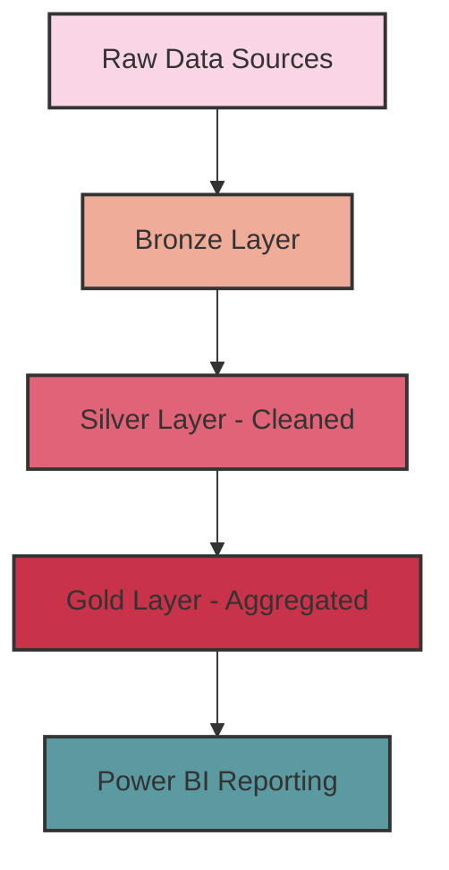

# Microsoft Fabric Jumpstart: Final Course Plan

## Course Timing Schedule (4 Hours)

- **11:00 AM** - Segment 1: Introduction to Microsoft Fabric (Terminology, Workspaces, Navigation)
- **12:00 PM** - 10-minute break
- **12:10 PM** - Segment 2: Batch Processing (Lakehouse, Warehouse, Reporting)
- **01:10 PM** - 10-minute break
- **01:20 PM** - Segment 3: Stream Processing (Raspberry Pi Sim Demo, Activator)
- **02:20 PM** - 10-minute break
- **02:30 PM** - Segment 4: Advanced Topics (Copilot for DAX, SQL, Python)
- **03:00 PM** - End of session

---

## Segment 1: Introduction to Microsoft Fabric

### Pre-Session Checklist
- Microsoft Fabric trial activated
- Demo workspace already created
- Sample files ready for upload
- Browser tabs open to Microsoft Learn resources

### Key Learning Objectives
- Understand Fabric's terminology and key concepts
- Navigate the Fabric interface confidently
- Set up and configure workspaces
- Identify main components and their purposes

### Step-by-Step Demo Plan

#### 1. Microsoft Fabric Overview
- Show the Fabric homepage at [fabric.microsoft.com](https://fabric.microsoft.com)
- **Click Path:** Sign in → Show the Fabric homepage → Navigate to Workspaces
- **Highlight:** Explain how Fabric unifies what were previously separate products
- **Visual Aid:** Show slide with Fabric architecture diagram

#### 2. Workspace Creation & Tour
- **Click Path:** Home → Create a Workspace → Name it "Contoso Analytics" → Create
- **Explain:** Fabric-enabled workspaces vs. regular Power BI workspaces
- **Click Path:** Inside workspace → Show different experience switcher (Data Engineering, Data Factory, etc.)
- **Highlight:** Point out how all experiences share the same data in OneLake

#### 3. RBAC Configuration
- **Click Path:** Workspace settings → Access
- **Explain:** Different roles (Admin, Member, Contributor, Viewer)
- **Demo:** Add a new user with specific permissions
- **Highlight:** Best practices for workspace security in enterprise environments

#### 4. First Data Upload
- **Click Path:** Create → Lakehouse → Name it "ContosoLakehouse"
- **File Upload:** 
  - Navigate to Files view
  - Upload `fabric-samples/emp.csv` file
  - Show the automatic schema detection
- **Highlight:** Point out that this data is now available across all Fabric experiences

#### 5. Q&A and Preview of Next Segment
- Address any immediate questions
- Preview what we'll do with this data in the next segment

### Can't-Miss Examples
- Show the **Sales dataset** example that's built into Fabric
- Demonstrate the **SQL endpoint** by clicking on "SQL analytics endpoint" in the lakehouse
- Show **workspace sharing** by adding a member with different permissions

### Quick Reference: Common Tasks
- **Create Workspace:** Home → Create Workspace → Name → Create
- **Add Member:** Workspace Settings → Access → Add Member
- **Upload Data:** Lakehouse → Files → Upload
- **View SQL Endpoint:** Lakehouse → SQL Analytics Endpoint

---

## Segment 2: Batch Processing in Fabric

### Pre-Session Checklist
- Lakehouse created from Segment 1
- Sample data files prepared
- Power BI Desktop installed

### Key Learning Objectives
- Implement medallion architecture in Lakehouse
- Create and manage Data Warehouses
- Build interactive reports with Power BI
- Understand Direct Lake mode benefits

### Step-by-Step Demo Plan

#### 1. Medallion Architecture Overview
- **Explain:** Bronze (raw), Silver (clean), Gold (business-ready) concept
- **Click Path:** Lakehouse → Files → Create folders called "Bronze", "Silver", "Gold"
- **Highlight:** Show slide with medallion data flow

#### 2. Data Pipeline Creation
- **Click Path:** New → Pipeline → Name it "Contoso Sales Ingest"
- **Step-by-Step:**
  1. Add Copy Data activity
  2. Source: HTTP connector
     - Base URL: `https://raw.githubusercontent.com/microsoft/fabric-samples/main/docs-samples/data/sales.csv`
     - Click "Preview data" to show sample
  3. Sink: Lakehouse
     - Connect to ContosoLakehouse
     - Select "Bronze" folder
     - File name: `sales.csv`
  4. Click "Validate" then "Run"
  5. Show successful pipeline execution

#### 3. Data Transformation with Notebook
- **Click Path:** New → Notebook → Name it "CleanSalesData"
- **Code Blocks to Type:**

  ```python
  # Read the bronze data
  df = spark.read.format("csv").option("header", "true").load("Files/Bronze/sales.csv")
  display(df)
  
  # Basic data cleaning
  from pyspark.sql.functions import col, when, trim
  
  df_clean = df \
      .withColumn("Revenue", col("Revenue").cast("double")) \
      .withColumn("Product", trim(col("Product"))) \
      .withColumn("Region", when(col("Region") == "N/A", None).otherwise(col("Region")))
  
  display(df_clean)
  
  # Save to silver layer as Delta table
  df_clean.write.format("delta").mode("overwrite").save("Files/Silver/sales_silver")
  
  # Create table from the saved files
  spark.sql("CREATE TABLE IF NOT EXISTS sales_silver USING DELTA LOCATION 'Files/Silver/sales_silver'")
  ```

- **Highlight:** Run each cell and explain the transformations

#### 4. Query the Transformed Data
- **Click Path:** Lakehouse → SQL endpoint
- Run a sample query:
  ```sql
  SELECT 
    Product,
    SUM(Revenue) as TotalRevenue
  FROM
    sales_silver
  GROUP BY
    Product
  ORDER BY
    TotalRevenue DESC
  ```

### Can't-Miss Examples
- Use the **Data Factory Copy assistant** to simplify pipeline creation
- Show **Delta Lake Time Travel** with this query:
  ```sql
  SELECT * FROM sales_silver VERSION AS OF 0
  ```
- Demonstrate **notebook visualization** tools by adding a simple bar chart visualization

### Quick Reference: Common Tasks
- **Create Pipeline:** New → Pipeline → Name
- **Add Copy Activity:** Pipeline → Activities → Copy Data
- **Create Notebook:** New → Notebook → Name
- **Run SQL Query:** Lakehouse → SQL Analytics Endpoint → New Query

---

## Segment 3: Stream Processing

### Pre-Session Checklist
- Raspberry Pi simulator ready
- Event stream templates prepared
- Sample IoT data generator configured

### Key Learning Objectives
- Set up real-time data streaming
- Configure event streams and KQL databases
- Use Activator for real-time insights
- Monitor and analyze streaming data

### Step-by-Step Demo Plan

#### 1. Completing Batch Processing: Gold Layer
- **Click Path:** Lakehouse → New notebook → "GoldLayerPrep"
- **Code to Type:**
  ```python
  # Create an aggregated gold table for reporting
  spark.sql("""
  CREATE OR REPLACE TABLE sales_gold AS
  SELECT 
    Product,
    Region,
    MONTH(Date) as Month,
    YEAR(Date) as Year,
    SUM(Revenue) as TotalRevenue,
    COUNT(*) as TransactionCount
  FROM 
    sales_silver
  GROUP BY 
    Product, Region, MONTH(Date), YEAR(Date)
  """)
  
  # View the results
  display(spark.sql("SELECT * FROM sales_gold"))
  ```
- **Highlight:** Explain how this aggregated view is now ready for reporting

#### 2. Real-Time Analytics Overview
- **Click Path:** Switch to "Real-Time Analytics" experience
- **Explain:** Event streams, KQL databases, real-time dashboards
- **Highlight:** Differences between batch and real-time processing

#### 3. KQL Database Creation
- **Click Path:** New → KQL Database → Name it "ContosoRealTime"
- **Click Path:** Inside database → Query
- **Simple KQL Query:**
  ```kql
  .create table SensorData (DeviceId: string, Temperature: real, Humidity: real, Timestamp: datetime)
  ```
- **Explain:** How KQL databases store and query time-series data efficiently

#### 4. Event Stream Setup
- **Click Path:** New → Eventstream → Name it "DeviceTelemetryStream"
- **Step-By-Step:**
  1. Add Source:
     - Select "Sample data source" (for demo purposes)
     - Configure to generate IoT-like data
  2. Add Destination:
     - Select KQL Database
     - Choose "ContosoRealTime"
     - Target table: "SensorData"
  3. Start the event stream
  4. Show events flowing in the monitoring view

### Can't-Miss Examples
- Show **built-in visualizations** in KQL query results (click the chart icons)
- Demonstrate **auto-refresh** on query results (set to 10-second refresh)
- Compare performance of batch vs. streaming queries for the same data volume

### Quick Reference: Common Tasks
- **Create KQL Database:** New → KQL Database → Name
- **Create Event Stream:** New → Eventstream → Name
- **Add Source:** Eventstream → Add Source → Configure
- **Add Destination:** Eventstream → Add Destination → Configure

---

## Segment 4: Advanced Topics

### Pre-Session Checklist
- Copilot enabled in Fabric
- Sample queries prepared
- Code snippets ready for enhancement
- Purview integration configured
- Certification resources ready

### Key Learning Objectives
- Leverage Copilot for DAX query generation
- Use Copilot to optimize SQL queries
- Enhance Python code with AI assistance
- Apply best practices for AI-assisted development
- Understand Fabric certification paths
- Implement Purview for data governance

### Step-by-Step Demo Plan

#### 1. Copilot for DAX
- **Click Path:** Power BI → Report → Copilot
- **Demos:**
  - Generate DAX measures from natural language
  - Optimize existing DAX calculations
  - Create complex time intelligence functions
- **Highlight:** How Copilot can accelerate DAX development

#### 2. Copilot for SQL
- **Click Path:** Data Warehouse → Query Editor → Copilot
- **Demos:**
  - Generate SQL queries from natural language
  - Refactor complex queries for performance
  - Add error handling to existing queries
- **Highlight:** Best practices for AI-assisted SQL development

#### 3. Copilot for Python
- **Click Path:** Notebook → Copilot
- **Demos:**
  - Generate data transformation code
  - Add documentation to existing code
  - Debug and optimize Python scripts
- **Highlight:** How to effectively prompt Copilot for code generation

#### 4. Purview Integration
- **Click Path:** Admin Portal → Purview
- **Demos:**
  - Connect Fabric to Purview
  - Scan Fabric assets for classification
  - View data lineage across Fabric and other sources
  - Apply sensitivity labels from Purview
- **Highlight:** Enterprise data governance with Purview

#### 5. Fabric Certification Paths
- **Explain:** Available certification options
  - DP-600: Implementing Analytics Solutions Using Microsoft Fabric
  - Future certifications in development
- **Resources:** Study guides, practice tests, and learning paths
- **Tips:** Exam preparation strategies and focus areas

#### 6. Q&A and Course Wrap-up
- Address final questions
- Provide resources for continued learning
- Course feedback collection

### Can't-Miss Examples
- **Copilot for DAX**: Generate a complex time intelligence measure
- **Copilot for SQL**: Optimize a query with window functions
- **Copilot for Python**: Generate a data quality check function
- **Purview Integration**: Show data lineage from source to report
- **Certification**: Walk through a sample exam question

### Quick Reference: Common Tasks
- **Use Copilot**: Click the Copilot icon in any editor
- **Connect to Purview**: Admin Portal → Purview → Connect
- **View Lineage**: Purview → Data Catalog → Lineage
- **Certification Resources**: [Microsoft Learn](https://learn.microsoft.com/certifications/)

## Additional Resources for Learners

### Microsoft Learn Modules
- [Get started with Microsoft Fabric](https://learn.microsoft.com/training/paths/get-started-fabric/)
- [Build a lakehouse in Microsoft Fabric](https://learn.microsoft.com/training/paths/build-lakehouse-fabric/)
- [Implement real-time analytics in Microsoft Fabric](https://learn.microsoft.com/training/paths/implement-real-time-analytics-fabric/)

### Sample Datasets
- [Microsoft Fabric samples GitHub](https://github.com/microsoft/fabric-samples)
- [Adventure Works sample database](https://learn.microsoft.com/sql/samples/adventureworks-install-configure)

### Certification Path
- [DP-600: Implementing Analytics Solutions Using Microsoft Fabric](https://learn.microsoft.com/certifications/exams/dp-600) 

### Mermaid Diagrams
These diagrams will help visualize the data flow through different segments of the course:

```mermaid
graph LR
    A[Event Source] -->|Real-time| B[Event Stream]
    B --> C[KQL Database]
    C --> D[Real-time Dashboard]
    
    style A fill:#bbdef0,stroke:#333,stroke-width:2px
    style B fill:#00a8e8,stroke:#333,stroke-width:2px
    style C fill:#007ea7,stroke:#333,stroke-width:2px
    style D fill:#003459,stroke:#333,stroke-width:2px
``` 



