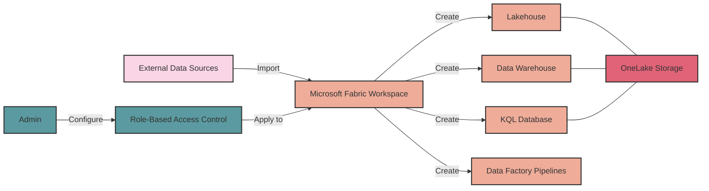
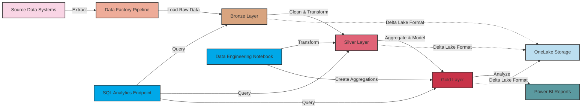
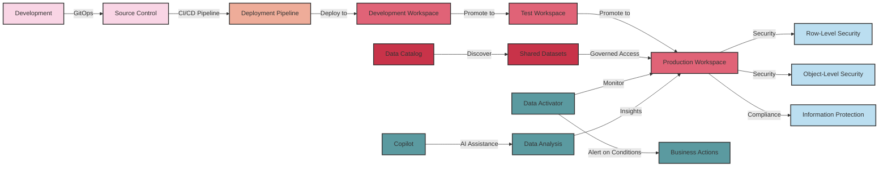
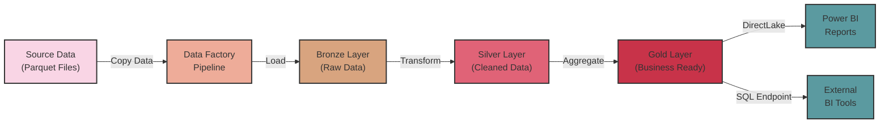
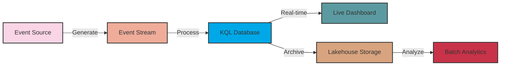

# Microsoft Fabric Mermaid Diagrams

These diagrams visualize the data flows in our Microsoft Fabric course segments. They're designed to be compatible with [mermaidchart.com](https://mermaidchart.com/) and VS Code with the Mermaid preview extension.

## Segment 1: Introduction to Microsoft Fabric

## Segment 2: Batch Processing in Fabric (Medallion Architecture)

## Segment 3: Batch and Streaming Analytics

```mermaid
graph LR
    A[Raspberry Pi IoT Simulator] -->|Generate Events| B[Event Hub]
    B -->|Real-time Ingestion| C[Event Stream]
    C -->|Process Events| D[KQL Database]
    D -->|Visualize| E[Real-time Dashboard]
    
    C -->|Archive Events| F[Bronze Layer - Raw Events]
    F -->|Transform| G[Silver Layer - Processed Events]
    G -->|Aggregate| H[Gold Layer - Aggregated Metrics]
    H -->|Report| I[Power BI]
    
    J[Stream Analytics] -->|Transform Stream| C
    J -->|Enrich Data| G
    
    classDef sourceNode fill:#f9d5e5,stroke:#333,stroke-width:2px
    classDef streamNode fill:#bbdef0,stroke:#333,stroke-width:2px
    classDef processNode fill:#00a8e8,stroke:#333,stroke-width:2px
    classDef storeNode fill:#007ea7,stroke:#333,stroke-width:2px
    classDef visualNode fill:#003459,stroke:#333,stroke-width:2px
    classDef bronzeNode fill:#d8a47f,stroke:#333,stroke-width:2px
    classDef silverNode fill:#e06377,stroke:#333,stroke-width:2px
    classDef goldNode fill:#c83349,stroke:#333,stroke-width:2px
    
    class A sourceNode
    class B,C streamNode
    class J processNode
    class D,F,G,H storeNode
    class E,I visualNode
```

## Segment 4: Fabric Certification

## End-to-End Lakehouse Architecture

```mermaid
graph LR
    A[Raw Data Source] -->|Extract| B[Data Factory Copy Activity]
    B -->|Load| C[Bronze Layer]
    C -->|Clean| D[Notebook Transformation]
    D -->|Process| E[Silver Layer] 
    E -->|Aggregate| F[Notebook Analytics]
    F -->|Model| G[Gold Layer]
    G -->|DirectLake| H[Power BI Semantic Layer]
    H -->|Visualize| I[Power BI Report]
    
    J[Streaming Source] -->|Real-time| K[Eventstream]
    K -->|Process| L[KQL Database]
    L -->|Analyze| M[Real-time Dashboard]
    L -->|Archive| C
    
    classDef sourceNode fill:#f9d5e5,stroke:#333,stroke-width:2px
    classDef ingestNode fill:#eeac99,stroke:#333,stroke-width:2px
    classDef bronzeNode fill:#d8a47f,stroke:#333,stroke-width:2px
    classDef processNode fill:#00a8e8,stroke:#333,stroke-width:2px
    classDef silverNode fill:#e06377,stroke:#333,stroke-width:2px
    classDef goldNode fill:#c83349,stroke:#333,stroke-width:2px
    classDef biNode fill:#5b9aa0,stroke:#333,stroke-width:2px
    classDef streamNode fill:#bbdef0,stroke:#333,stroke-width:2px
    classDef rtNode fill:#007ea7,stroke:#333,stroke-width:2px
    
    class A,J sourceNode
    class B,K ingestNode
    class C bronzeNode
    class D,F processNode
    class E silverNode
    class G goldNode
    class H,I biNode
    class L streamNode
    class M rtNode
```

## IoT to Lakehouse Scenario

```mermaid
graph LR
    A[Raspberry Pi IoT Simulator] -->|Generate Telemetry| B[IoT Hub]
    B -->|Route Events| C[Stream Analytics]
    C -->|Process Stream| D[Event Hub]
    D -->|Real-time Processing| E[KQL Database]
    E -->|Visualize| F[Real-time Dashboard]
    
    C -->|Store Processed Data| G[Data Lake]
    G -->|Load| H[Data Factory ELT Pipeline]
    H -->|Transform| I[Lakehouse Bronze]
    I -->|Clean| J[Lakehouse Silver]
    J -->|Aggregate| K[Lakehouse Gold]
    K -->|Analyze| L[Power BI Report]
    
    classDef deviceNode fill:#f9d5e5,stroke:#333,stroke-width:2px
    classDef ingestNode fill:#eeac99,stroke:#333,stroke-width:2px
    classDef processNode fill:#e06377,stroke:#333,stroke-width:2px
    classDef streamNode fill:#bbdef0,stroke:#333,stroke-width:2px
    classDef storageNode fill:#00a8e8,stroke:#333,stroke-width:2px
    classDef bronzeNode fill:#d8a47f,stroke:#333,stroke-width:2px
    classDef silverNode fill:#e06377,stroke:#333,stroke-width:2px
    classDef goldNode fill:#c83349,stroke:#333,stroke-width:2px
    classDef visualNode fill:#5b9aa0,stroke:#333,stroke-width:2px
    classDef lhNode fill:#d8a47f,stroke:#333,stroke-width:2px
    
    class A deviceNode
    class B,D ingestNode
    class C processNode
    class E,G storageNode
    class H,I,J,K lhNode
    class F,L visualNode
```

## Microsoft Learn Lakehouse End-to-End Tutorial

This simplified diagram shows the core data flow in the Microsoft Learn lakehouse tutorial:

1. Source data ingestion through Data Factory pipelines
2. Data flowing through the medallion architecture (Bronze → Silver → Gold)
3. Consumption methods via DirectLake to Power BI or SQL endpoint for external tools 

## Simple Batch Processing Flow

```mermaid
graph LR
    Source["Data Sources"] -->|Extract| Ingest["Data Ingestion"]
    Ingest -->|Load| Storage["Lakehouse Storage"]
    Storage -->|Process| Transform["Data Transformation"]
    Transform -->|Load| Warehouse["Semantic Layer"]
    Warehouse -->|Visualize| Report["Reports & Dashboards"]
    
    classDef sourceNode fill:#f9d5e5,stroke:#333,stroke-width:2px
    classDef ingestNode fill:#eeac99,stroke:#333,stroke-width:2px
    classDef storageNode fill:#d8a47f,stroke:#333,stroke-width:2px
    classDef transformNode fill:#e06377,stroke:#333,stroke-width:2px
    classDef warehouseNode fill:#c83349,stroke:#333,stroke-width:2px
    classDef reportNode fill:#5b9aa0,stroke:#333,stroke-width:2px
    
    class Source sourceNode
    class Ingest ingestNode
    class Storage storageNode
    class Transform transformNode
    class Warehouse warehouseNode
    class Report reportNode
```

## Simple Streaming Data Flow

## Simple Medallion Architecture

```mermaid
graph LR
    Source["Data Sources"] -->|Ingest Raw Data| Bronze["Bronze Layer<br>Raw / Unprocessed"]
    Bronze -->|Clean & Validate| Silver["Silver Layer<br>Cleansed / Conformed"]
    Silver -->|Transform & Model| Gold["Gold Layer<br>Business Ready"]
    Gold -->|Consume| BI["Analytics & Reporting"]
    
    classDef sourceNode fill:#f9d5e5,stroke:#333,stroke-width:2px
    classDef bronzeNode fill:#d8a47f,stroke:#333,stroke-width:2px
    classDef silverNode fill:#e06377,stroke:#333,stroke-width:2px
    classDef goldNode fill:#c83349,stroke:#333,stroke-width:2px
    classDef biNode fill:#5b9aa0,stroke:#333,stroke-width:2px
    
    class Source sourceNode
    class Bronze bronzeNode
    class Silver silverNode
    class Gold goldNode
    class BI biNode
``` 

