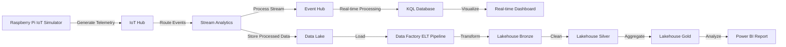
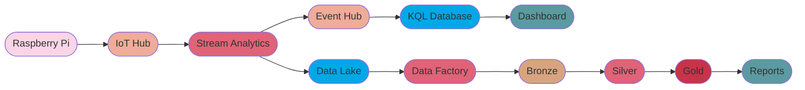
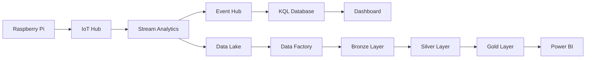

# Simplified IoT to Lakehouse Diagram

This simplified diagram shows the Raspberry Pi IoT data flow to Lakehouse and reporting, with minimal styling for maximum compatibility with mermaidchart.com.

## Alternative Version with Minimal Styling

## Text-only Version for Maximum Compatibility

